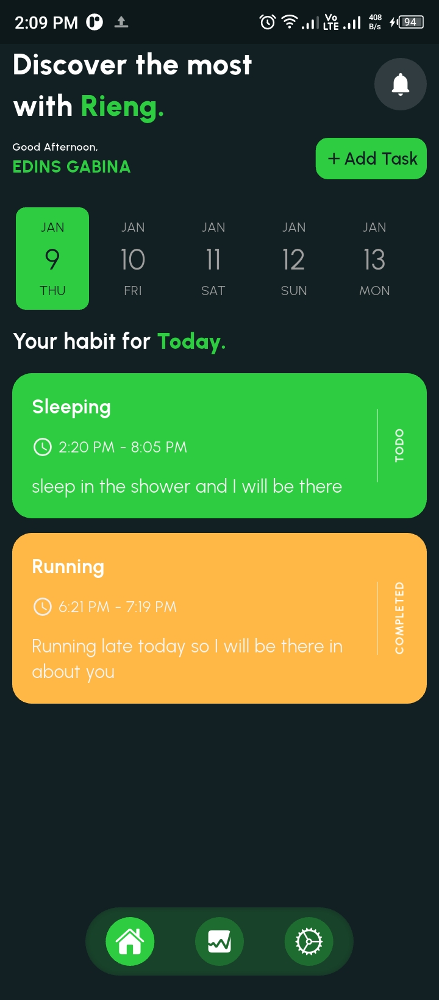
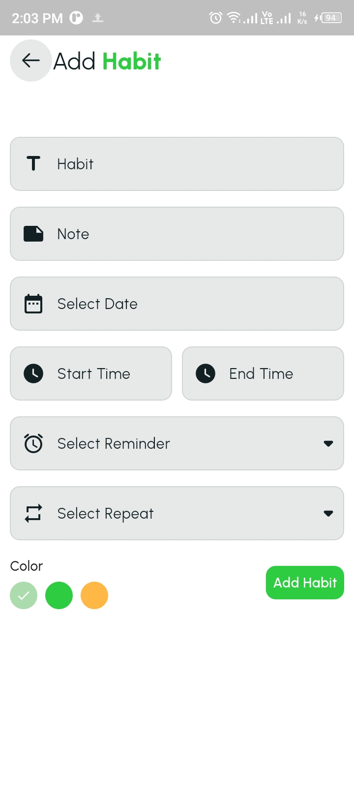

# 🔖RIENG

### Rieng, meaning "Formation" in Kenyan slang, is Empowering Kenyans to Form a Better Future Through Sustainable Habit Formation.

RIENG is a comprehensive mobile application designed to empower Kenyans to cultivate positive habits and achieve their personal and professional goals. Recognizing the pivotal role of consistent action in personal growth, RIENG provides a user-friendly platform for individuals to track a wide range of habits, from daily routines like exercise and mindfulness to long-term aspirations such as learning a new language or starting a business.
## Project Screenshots

**Here's a glimpse of what this project offers:**

| Splash Screen                                 | Landing Page                                  | Landing Page                                  | Landing Page                                  | Login Page                                    |
|-----------------------------------------------|-----------------------------------------------|-----------------------------------------------|-----------------------------------------------|-----------------------------------------------|
|  |  |  |  |  |

| Sign Up Page                                  | Sign Up Notification                          | Sign Up Loading                               | Sign Up Successful                            | Rest Password                                   |
|-----------------------------------------------|-----------------------------------------------|-----------------------------------------------|-----------------------------------------------|-------------------------------------------------|
|  |  |  |  |  |

| Reset Password Successful                      | Login Page Successful                          | Home Page Light Mode                           | Home Page Light Mode                           | Home Page Dark Mode                             |
|------------------------------------------------|------------------------------------------------|------------------------------------------------|------------------------------------------------|-------------------------------------------------|
|  |  |  |  |  |

| Create Habit Light Mode                        | Create Habit Dark Mode                         | Bottom Action Light Mode                       | Bottom Action Dark Mode                        | Bottom Action Light Mode                        |
|------------------------------------------------|------------------------------------------------|------------------------------------------------|------------------------------------------------|-------------------------------------------------|
|  |  |  |  |  |

| Bottom Action Dark Mode                        | Notification Light Mode                        | Notification Dark Mode                         | Statistics Light Mode                          | Statistics Dark Mode                            |
|------------------------------------------------|------------------------------------------------|------------------------------------------------|------------------------------------------------|-------------------------------------------------|
|  |  |  |  |  |

| Profile Page Light Mode                        | Profile Page Dark Mode                         | Edit Profile                                   | Edit Profile                                   | Local Notification                              |
|------------------------------------------------|------------------------------------------------|------------------------------------------------|------------------------------------------------|-------------------------------------------------|
|  |  |  |  |  |

## Dependencies
This app utilizes the following external libraries to provide various functionalities:

### UI/UX

- **cupertino_icons:** Provides access to Apple-designed icons for use in Cupertino-style widgets.
- **smooth_page_indicator:** Creates smooth and visually appealing indicators for paginated content (e.g., sliders, view pagers).
- **flutter_custom_clippers:** Offers a collection of pre-made and customizable clippers to create unique shapes for your UI elements.

### State Management & Data Handling

- **get_storage:** A simple and efficient key-value storage solution for persisting data locally.
- **get:** A powerful state management solution for building complex Flutter applications.
- **intl:** Provides internationalization and localization support for your app (e.g., handling different languages, date/time formats).

### Date & Time

- **date_picker_timeline:** Allows users to select dates from a timeline view.
- **flutter_datetime_picker:** Provides a customizable date and time picker widget.

### Database & Storage

- **sqflite:** A plugin for interacting with SQLite databases on various platforms.
- **cloud_firestore:** A cloud-based NoSQL database provided by Firebase.
- **firebase_core:** The core Firebase plugin, required for using other Firebase services.
- **firebase_auth:** Handles user authentication within your Firebase project.
- **firebase_storage:** Allows you to upload and download files to Firebase Cloud Storage.

### Animations & Effects

- **flutter_staggered_animations:** Creates staggered animations for a more visually appealing and engaging user experience.
- **loading_animation_widget:** Provides a variety of pre-built loading animations for user feedback.

### Notifications & Background Tasks

- **flutter_local_notifications:** Enables the display of local notifications within your app.

### Other

- **persistent_bottom_nav_bar:** Creates a persistent bottom navigation bar for easy navigation within your app.
- **flutter_heatmap_calendar:** Displays a heatmap calendar to visualize data over time.

**RIENG** aims to empower Kenyans to live healthier, more fulfilling lives by making habit formation simple, enjoyable, and sustainable.